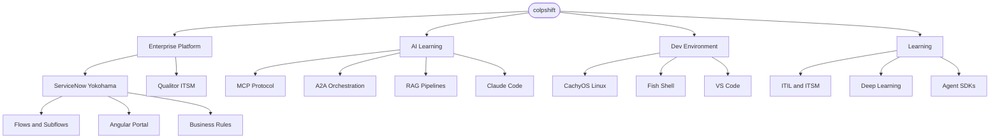

 

`São Paulo, Brazil` &nbsp;·&nbsp; `AI-native workflow` &nbsp;·&nbsp; `Claude Code daily`

---

### About

I build enterprise integrations and automation on **ServiceNow** and **Angular** — flows, subflows, business rules, client scripts, and service portals that people actually rely on.

On the AI side, I'm actively learning **MCP (Model Context Protocol)**, **A2A**, **RAG pipelines**, **Generative AI**, and **Deep Learning** — going beyond prompts to understand how these systems actually work.

My daily stack is **CachyOS Linux + Fish shell + VS Code + Claude Code**. The IDE is a tool; the AI is a force multiplier.

> *The goal is always the same: close the gap between what I know and what the problem needs.*

---

### Arsenal

**Languages**

**Platforms & Frameworks**

**AI & Agentic Systems**

**Environment**

---

### Ecosystem Map

---

### AI Learning Journey

Actively learning AI — not just using tools, but understanding what's under the hood.

- **MCP (Model Context Protocol)** — how AI models connect to live data and external context
- **A2A (Agent-to-Agent)** — multi-agent coordination and orchestration patterns
- **RAG pipelines** — retrieval-augmented generation for knowledge-grounded AI responses
- **Generative AI** — applied concepts: prompting, fine-tuning, evaluation, deployment
- **Deep Learning** — fundamentals: neural networks, transformers, embeddings
- **Claude Code** — daily collaborator, not a search engine — learning by building alongside it

The goal: apply AI knowledge directly to **ServiceNow and Angular workflows** to understand what's possible and what's not.

---

### Stats

&nbsp;&nbsp;

---

### Trophies

---

### Now

- Deepening **ServiceNow Yokohama** — UI Builder, Angular Service Portal, advanced Flow Designer patterns
- Building **AI agent integrations** using MCP and A2A on top of real enterprise workflows
- Bridging ITIL/ITSM fundamentals with AI-assisted service management

---

### Connect

---

